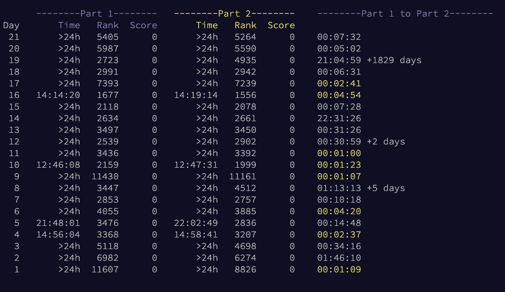

# Advent of Code private stats Part 2 Timer

See the difference in time between gaining 2 stars for the day on your [Advent of Code](https://www.adventofcode.com/) private stats page.

## Installation

* Firefox - https://addons.mozilla.org/en-US/firefox/addon/advent-of-code-part-2-timer/
* Chrome - https://chrome.google.com/webstore/detail/advent-of-code-part-2-timer/fhmjpoppaplfhgnknpbaaklgdnnimfbn

**Note:** you must generate a private leaderboard for this extension to work.

## Building locally

To build the extension locally, run `npm install && npm run build`. This will generate an exploded version of the extension in the `dist/` folder.

Use [`web-ext run`](https://github.com/mozilla/web-ext) from the `dist/` folder to run it locally in Firefox, or `web-ext build` to create a package.
